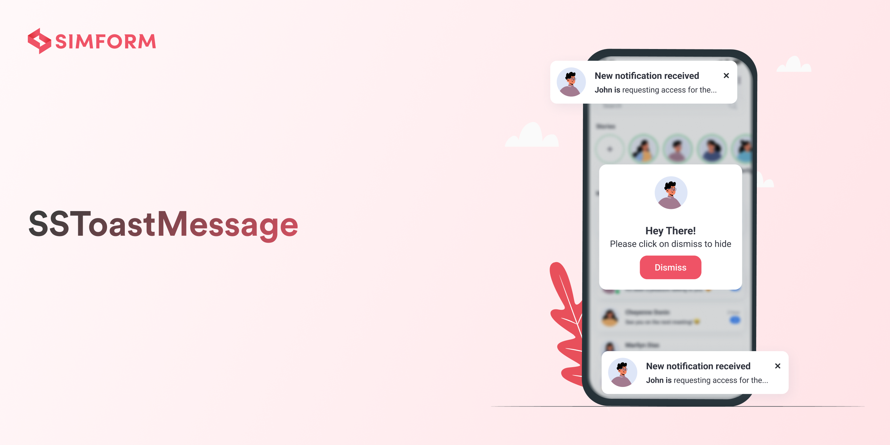
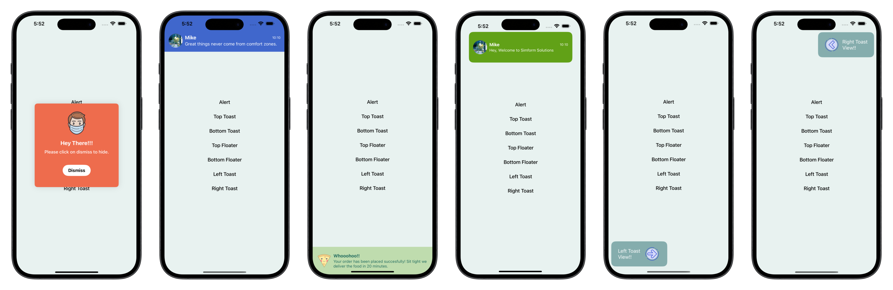
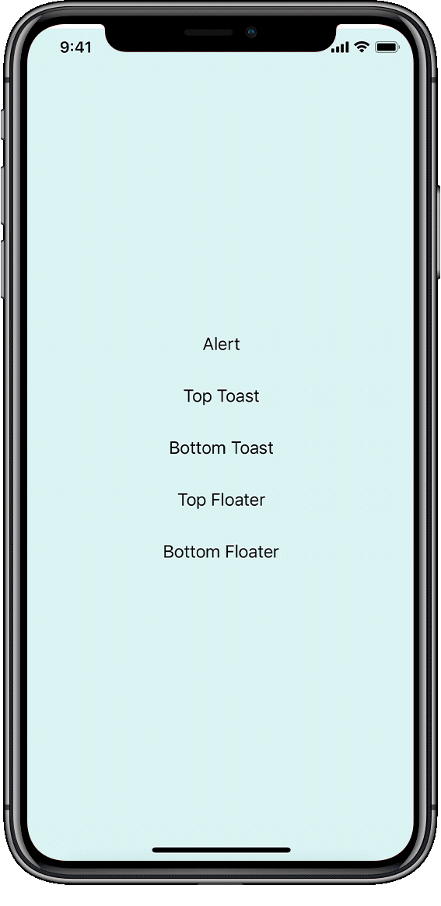

SSToastMessage
=============

[](http://cocoadocs.org/docsets/SSToastMessage)
[](http://cocoapods.org/pods/SSToastMessage)
[](https://cocoapods.org/pods/SSToastMessage)
[](https://developer.apple.com/documentation/swiftui)
[![Swift Version][swift-image]][swift-url]
[![PRs Welcome][PR-image]][PR-url]
[](https://twitter.com/simform)

Create Toast Views with Minimal Effort in SwiftUI Using SSToastMessage. SSToastMessage enables you to effortlessly add toast notifications, alerts, and floating messages to any view on both iPhone and macOS. With SSToastMessage, you can display left and right toast views over any top-level view, making it incredibly versatile and powerful. Designed to be simple, lightweight, and user-friendly, SSToastMessage allows you to show popups with a single line of code. Enhance your app's user experience with seamless and stylish notifications.

## Features

- [x] Customisable toast view
- [x] Multiple options for show toast view
- [x] Cross-Platform (iOS & macOS)
- [x] Flexible Positioning


Screenshots
---------



Setup Instructions
------------------
[CocoaPods](http://cocoapods.org)
------------------
To integrate Toast-Swift into your Xcode project using CocoaPods, specify it in your `Podfile`:
```ruby
pod 'SSToastMessage'
```
and in your code add `import SSToastMessage`.

[Swift Package Manager](https://swift.org/package-manager/)
------------------
When using Xcode 11 or later, you can install `SSToastMessage` by going to your Project settings > `Swift Packages` and add the repository by providing the GitHub URL. Alternatively, you can go to `File` > `Swift Packages` > `Add Package Dependencies...`

         dependencies: [
             .package(url: "https://github.com/SimformSolutionsPvtLtd/SSToastMessage.git", from: "1.0.0")
         ]

## Manually

1. Add `MessageView.swift`, `DispatchWorkHolder.swift`, `ViewModel.swift` and `View+Extension.swift` to your project.
2. Grab yourself a cold 🍺.

## Requirements
* iOS 14+
* macos 13+
* Xcode 11+

# Usage
1. Put all your body code into a ZStack, VStack, or HStack. 
2. Add a binding bool to control popup presentation state
3. Add `.present` modifier to your stack
4. If you are using NavigationBar or Custom Navigation view then add `.present` modifier to NavigationBar or Custom Navigation view.

Basic Examples
---------
```swift
struct ContentView: View {
    @State var showToast = false
    var body: some View {
        VStack {
            // your screen main stack
            Button(action: {
                self.showToast.toggle()
            }) {
                Text("Show Toast")
                    .foregroundColor(.black)
            }
        }
        .present(isPresented: self.$showToast, type: .toast, position: .top) {
           /// create your own view for toast
            self.createTopToastView()
        }
    }
    
    func createTopToastView() -> some View {
        VStack {
            Spacer(minLength: 20)
            HStack() {
                Image("mike")
                    .resizable()
                    .aspectRatio(contentMode: ContentMode.fill)
                    .frame(width: 50, height: 50)
                    .cornerRadius(25)

                VStack(alignment: .leading, spacing: 2) {
                    HStack {
                        Text("Mike")
                            .foregroundColor(.white)
                            .fontWeight(.bold)
                        Spacer()
                        Text("10:10")
                            .font(.system(size: 12))
                            .foregroundColor(Color(red: 0.9, green: 0.9, blue: 0.9))
                    }

                    Text("Hey, Don't miss the WWDC on tonight at 10 AM PST.")
                        .lineLimit(2)
                        .font(.system(size: 14))
                        .foregroundColor(.white)
                }
            }.padding(15)
        }
        .frame(height: 110)
        .background(Color(red: 0.85, green: 0.65, blue: 0.56))
    }
}
```

<br> </br>
<p align="center">
  
</p>
<br> </br>

Way easy to customize!
---------
### Required parameters 
`presented` - binding to determine if the message view should be seen on-screen or hidden     
`view` - view you want to display on your message view 

### Available customizations - optional parameters    

Element | Declaration | Description
--------|-----------|-----
type | `type: MessageType` | set type of view alert, toast and floater, left toast view and right toast view.
position | `position: Position` |  top or bottom (for default case it just determines animation direction).
animation | `animation: Animation` | custom animation for message view sliding onto screen.
horizontalPadding | `horizontalPadding: Double?` | for adding horizontalPadding in toast view.
duration | `duration: Double?` |  time after which message view should disappear.
closeOnTap | `closeOnTap: Bool` | on message view tap it should disappear.
closeOnTapOutside | `closeOnTapOutside: Bool` | on outside tap message view should disappear.
onTap | `onTap: () -> Void` | on message view tap perform any action or navigation.
onToastHide | `onToastHide: () -> Void` | on toast hide perform any action.


See the demo project for more examples.

## 🤝 How to Contribute

Whether you're helping us fix bugs, improve the docs, or a feature request, we'd love to have you! :muscle:

Check out our [**Contributing Guide**](CONTRIBUTING.md) for ideas on contributing.

## Find this example useful? ❤️

Give a ⭐️ if this project helped you!

## Check out our other Libraries

<h3><a href="https://github.com/SimformSolutionsPvtLtd/Awesome-Mobile-Libraries"><u>🗂 Simform Solutions Libraries→</u></a></h3>


## MIT License

This project is licensed under the MIT License - see the [LICENSE](LICENSE) file for details

[PR-image]:https://img.shields.io/badge/PRs-welcome-brightgreen.svg?style=flat
[PR-url]:http://makeapullrequest.com
[swift-image]:https://img.shields.io/badge/swift-5.0-orange.svg
[swift-url]: https://swift.org/
